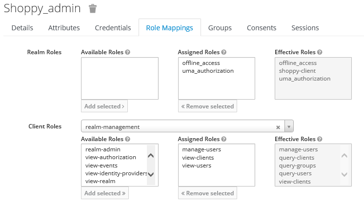
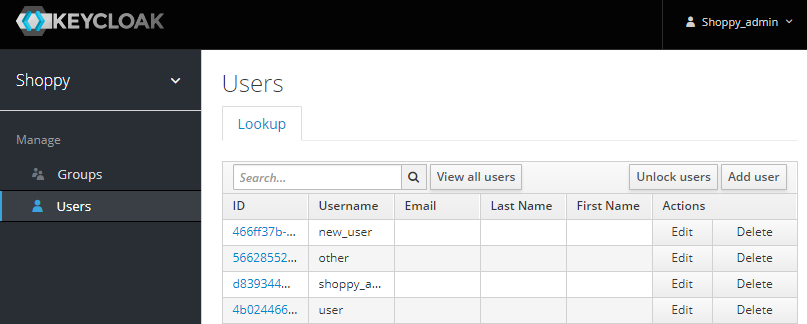

# Simple administration console

A user can be created to manage the other users and groups.

## Create a admin user

Create another user named, for exemple, `shoppy_admin` and make him join the `shoppy_group` in user the `Groups` tab.
Then, in the `Role Mappings` tab give him some realm administration wrights :
- manage_users
- view-users
- view-clients
  

## Open the administration console

Go to the site [Shoppy user administration console](http://localhost:8081/auth/admin/shoppy/console/#/realms/shoppy/users).
The admin user can now manage groups and users.

## Managing the clients

See the [official documentation](https://www.keycloak.org/docs/latest/server_admin/#_admin_permissions).