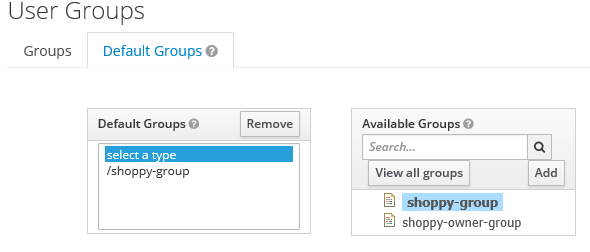

# Keycloak

[Keycloak](https://www.keycloak.org/) provide a simple way to manage users and their credentials.

## Installation

Keycloak is used with a postgres DB.

```
version: '3'

volumes:
  postgres_data:
      driver: local
      
services:
  postgres:
      image: postgres
      volumes:
        - postgres_data:/var/lib/postgresql/data
      environment:
        POSTGRES_DB: keycloak
        POSTGRES_USER: keycloak
        POSTGRES_PASSWORD: password

  keycloak:
    image: jboss/keycloak
    environment:
      - TZ=Europe/Paris
      - KEYCLOAK_USER=admin
      - KEYCLOAK_PASSWORD=adminadmin
      - DB_VENDOR=POSTGRES
      - DB_ADDR=postgres
      - DB_DATABASE=keycloak
      - DB_USER=keycloak
      - DB_SCHEMA=public
      - DB_PASSWORD=password
    depends_on:
      - postgres
    ports:
        - "8081:8080"
```

## Login as administrator

Go to the page http://localhost:8081/auth/admin/master/console/#/realms/master/clients, and log as the administrator. With the configuration shown in the previous section use the user `admin` and the password `adminadmin`.


## Create a realm

The default realm is 'Master'. We need to create another one to manage our application. Let's create the 'shoppy' realm by clicking on the button 'Add realm' under 'Master' label.


## Create the realm for CORS

TODO

## Create a client

Our application will be a client for Keycloak. In this project a Angular frontend will connect to Keycloak as a client named `shoppy-ui`.

Choose `Clients` on the left menu then click on the `Create` button.


Enter `shoppy-ui` as the client ID and `openid-connect` will be the client protocol. Then save.


## Complete the client settings

For stater, the client settings must be completed in order to be usable when the Angular app will be in developpement.

The `Access Type` will be public. The other default values will not be changed.


The `Valid Redirect URIs` is set to the address of the Angular application in developpement mode, started with `ng serv`.

The `Web Origins` is set to *. This will allow the Cross Origin Resource Sharing from the Angular app to Keycloak API.


Then click on the `Save` button at be bottom of the form.

## Roles

### Create a role in the realms


From the `Roles` view create a new one by clicking the `Add Role` buton. Create a `shoppy-client` role.

### Create a role for a client

A role can be created only for a specific client. The client roles can be created in the `Roles` tab of a client details.

## Groups

### Create a group for users


From the `Groups` view create a new one by clicking the `New` buton. Create a `shoppy-group` role.

In the `Role mappings` tab assing the `shoppy-client` role to the `Realm Roles`.

In the `Client Roles` drop box, choose `account` and assign `view-profile` role.
* The `view-profile` role isn't mandatory, it was added to grant access to the account detail. *


A client role can be added too by naming the client in the `Client Roles` drop box.


### Set a default group

When creating new users some default groups can be joined automatically by selecting them in the Groups `Default Groups` tab.



## Create a user

From the `User` view create a new user following the [official documentation](https://www.keycloak.org/docs/latest/server_admin/#_create-new-user).

Under the `Groups` tab, from the `Avaliable Groups` select the `shoppy-group` and click the `Join button`.


By doing this, the roles assigned to the group will be also assigned to this user. You can check that under the `Role Mappings` tab in the `Effective Roles` list.


## Test with Postman

### New collection

Under Postman create a new collection with a `OAuth 2.0` authorization and add auth data to the `Request Headers`.


Then, click on the `Get New Acces Token` and configure with the `shoppy-ui` client information. We will use the `Password Credentials` as grant type with the user and password previously used in Keycloak. The token endpoint form the `shoppy` realms is http://localhost:8081/auth/realms/shoppy/protocol/openid-connect/token.
The client id is `shoppy-ui`. The client authentication is `Send as Basic Auth header`.


The click on the `Request Token button`. The given token can be decoded with the [jwt.io](https://jwt.io/) web site.
As a result, the JWT will contain the following payload data.

```json
{
  "jti": "7411885c-4c2c-4a0b-a4f2-cdf20f5504a0",
  "exp": 1583356597,
  "nbf": 0,
  "iat": 1583356297,
  "iss": "http://localhost:8081/auth/realms/shoppy",
  "aud": "account",
  "sub": "4b024466-1d71-43bb-b53e-1d8657b058dc",
  "typ": "Bearer",
  "azp": "shoppy-ui",
  "auth_time": 0,
  "session_state": "8b8029d7-1d2d-4b66-b648-cd4a00a62d6b",
  "acr": "1",
  "allowed-origins": [
    "*"
  ],
  "realm_access": {
    "roles": [
      "shoppy-client",
      "offline_access",
      "uma_authorization"
    ]
  },
  "resource_access": {
    "account": {
      "roles": [
        "manage-account",
        "manage-account-links",
        "view-profile"
      ]
    }
  },
  "scope": "email profile",
  "email_verified": true,
  "preferred_username": "user"
}
```

